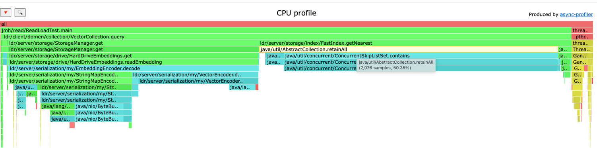
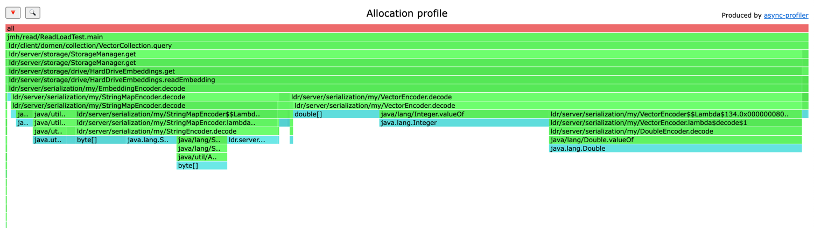
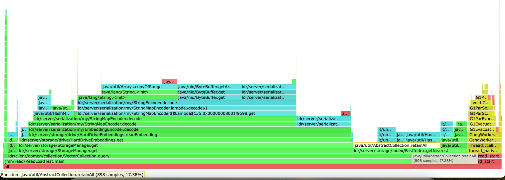
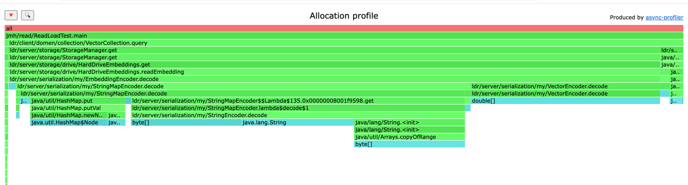

# Оптимизация векторной базы данных

## Подготовка

Для воспроизводимости тестов база данных была инициализирована и сохранена заранее, в нее было залита 100_000 векторов
размерностью 100.
Также был сохранен вектор, для которого искались ближайшие соседи при бенче.
Подробнее можно посмотреть в [скрипте](./src/jmh/java/jmh/read/Prepare.java).

## Замеры до оптимизации

Были провдены замеры на поиск ближайшего вектора. [Бенч](./src/jmh/java/jmh/read/ReadBenchmark.java).

[Результат замеров:](./jmh/results/before_optimization.txt)

```
Benchmark           Mode  Cnt   Score   Error  Units
ReadBenchmark.test  avgt   25  62,205 ± 2,672  ms/op
```

Имеем поиск ближайшего вектора в среднем за 62 мс.

## Профиль и Оптимизации

Для фоновой работы приложения на чтение и снятие профилей был
написан [скрипт](./src/jmh/java/jmh/read/ReadLoadTest.java).
Скрипт генерирует рандомный вектор и ищет его в подготовленной коллекции, генерация и поиск повторяется 10_000 раз.

После снятие профиля cpu были найдены места, которые стоит попробовать оптимизировать в первую очередь.

1) 50% семплов попали в retainAll для HashSet.
   
   Было решено заменить его на LongSet из fastutil.
2) 4% семплов попало в боксинг Integer.
   
   Было решено избавиться от всех оберток и перейти на примитивы.

Профиль аллоков показал, что 50 % аллоков приходится на обертки Double и Integer,
что еще раз показало необходимость перехода на примитивы:


## Замеры после оптимизации

Были проведены оптимизации:

1) Везде где возможно начали применяться коллекции, поддерживающие работу с примитивами из fast.util.
2) В декодерах данных из бинарного формата были убраны обертки.


На профилях видно, что retainAll теперь начал занимать 18 процентов сэмплов вместо 50:


Профиль аллоков тоже изменился, теперь тут нет оберток примитивов:


Данные оптимизации дали хорошие результаты, среднее время поиска ближайшего вектора сократилось в 3 раза, c 60 до 18 мс.
[Замер](./jmh/results/after_optimization_with_func_integer_fixed.txt).
```
Benchmark           Mode  Cnt   Score   Error  Units
ReadBenchmark.test  avgt   25  18,527 ± 0,177  ms/op
```
